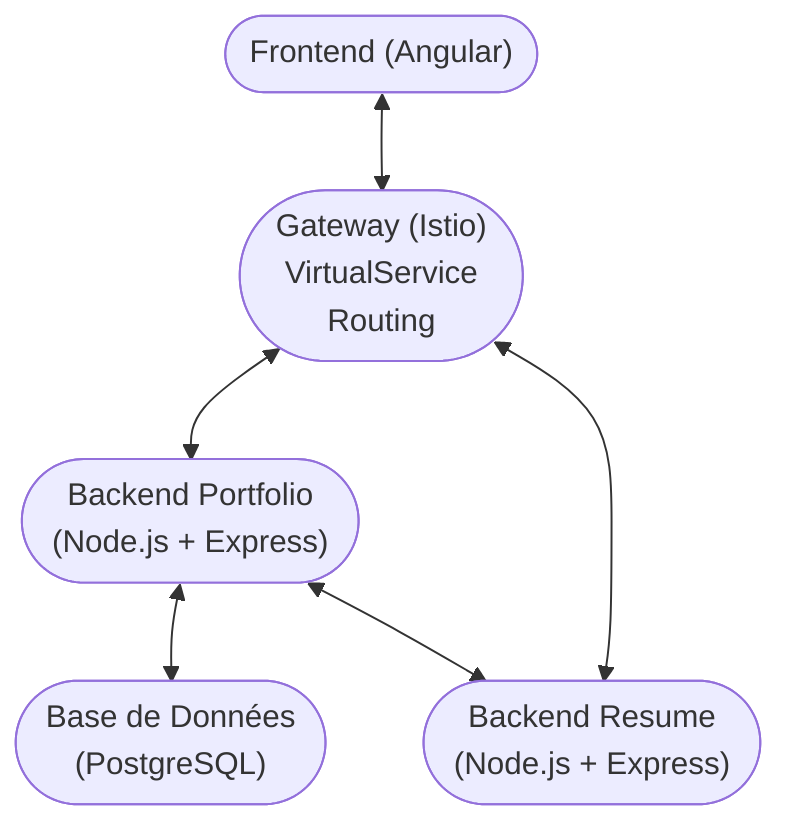

# Portfolio generator

## Requirements

Before executing the project, you need to ensure that all the following tools are installed on your computer :

- Docker
- Minikube
- kubectl
- istioctl
- Node (npm)
- Angular (globally installed)

If this is not the case, here are the commands for installing them.

### MacOS

```bash
# Install Docker Desktop
brew install --cask docker

# Install Minikube
brew install minikube

# Install kubectl
brew install kubectl

# Install Node
brew install node

# Install Angular
sudo npm install -g @angular/cli

# Install Istio
curl -L https://istio.io/downloadIstio | sh -
# Move istio into the right directory
mv istio-* ~/

# Add istioctl to the path (for zsh)
# Add istioctl to the path (for zsh)
ISTIO_DIR=$(find $HOME -maxdepth 1 -type d -name "istio-*" | sort -V | tail -n 1)
if [ -n "$ISTIO_DIR" ]; then
    # Check if the path is already in .zshrc
    if ! grep -q "$ISTIO_DIR/bin" ~/.zshrc; then
        echo "export PATH=$ISTIO_DIR/bin:\$PATH" >> ~/.zshrc
        echo "Istio path added: $ISTIO_DIR/bin"
        echo "Please restart your terminal or run 'source ~/.zshrc' for changes to take effect"
    else
        echo "Istio path already in .zshrc: $ISTIO_DIR/bin"
    fi

    # For the current session only
    export PATH=$ISTIO_DIR/bin:$PATH
else
    echo "No Istio directory found in $HOME"
fi

source ~/.zshrc
```

### Linux (Ubuntu or Debian)

```bash
# Install Docker
sudo apt-get update
sudo apt-get install docker.io
sudo systemctl enable docker
sudo systemctl start docker
sudo usermod -aG docker $USER

# Install Minikube
curl -LO https://storage.googleapis.com/minikube/releases/latest/minikube-linux-amd64
sudo install minikube-linux-amd64 /usr/local/bin/minikube

# Install kubectl
curl -LO "https://dl.k8s.io/release/$(curl -L -s https://dl.k8s.io/release/stable.txt)/bin/linux/amd64/kubectl"
sudo install -o root -g root -m 0755 kubectl /usr/local/bin/kubectl

# Install Istio
curl -L https://istio.io/downloadIstio | sh -
# Move istio into the right directory
mv istio-* ~/
# Add istioctl to the PATH
echo 'export PATH=$HOME/istio-*/bin:$PATH' >> ~/.bashrc
source ~/.bashrc
```

### Windows (with Chocolatey)

```bash
# Manually install docker desktop (docker.com)

# Install Minikube
choco install minikube

# Install kubectl
choco install kubernetes-cli

# Install Istio
# Download manually from https://github.com/istio/istio/releases
# Unzip the file and add the bin folder to your PATH
```

## Installation and start

### Automatically (recommanded)

```bash
./deploy.sh
```

Then go to http://localhost/4200

### Manually

First you need to install the dependencies at the `root` in the `backend-portfolio`, `backend-resume` and `frontend/portfolio-generator` folders :

```bash
npm install
```

## Service Mesh : Istio

The cluster needs to be started :

```bash
minikube start
istioctl install --set profile=demo -y
kubectl label namespace default istio-injection=enabled --overwrite
```

Apply the ressources in **this specfic order** :

```bash
kubectl apply -f k8s/service-mesh/
kubectl apply -f k8s/config/
kubectl apply -f k8s/database/
kubectl logs deployment/postgres

kubectl get pods -l app=postgres
kubectl cp database/src/init.sql <postgres-name>:/init.sql
kubectl cp database/src/populate.sql <postgres-name>:/populate.sql
kubectl cp database/src/verify_data.sql <postgres-name>:/verify_data.sql

kubectl exec -it <postgres-id> -- psql -U admin -d portfolio -f /init.sql
kubectl exec -it <postgres-id> -- psql -U admin -d portfolio -f /populate.sql
kubectl exec -it <postgres-id> -- psql -U admin -d portfolio -f /verify_data.sql

# when jobs are done
kubectl apply -f k8s/backend-portfolio/
kubectl apply -f k8s/backend-resume/
```

Check the creations of the ressources :

```bash
kubectl get configmap
kubectl get secret
kubectl get gateway
kubectl get virtualservice
kubectl get deployments
kubectl get pods
kubectl get services
```

To know the IP address and the access port to te gateway :

```bash
kubectl get svc -n istio-system
```

Test the app via istio :

```bash
kubectl -n istio-system port-forward deployment/istio-ingressgateway 31380:8080
```

or via another terminal or directly by accessing the link :

```bash
curl -v http://127.0.0.1:31380/api/portfolio/openapi
curl -v http://127.0.0.1:31380/api/resume/openapi
```

To have the logs :

```bash
kubectl get pods -n istio-system
kubectl logs -n istio-system <istio-ingressgateway-id>
kubectl get pods
kubectl logs <service-pod>
kubectl logs -f <pod-id>
kubectl logs deployment/postgres
```

If changes are made to a service (new docker image to pull, etc.) :

```bash
kubectl delete pod -l app=<service>-backend
kubectl apply -f k8s/backend-<service>/
```

## Dev notes



## Authors

- Térence Barbotin
